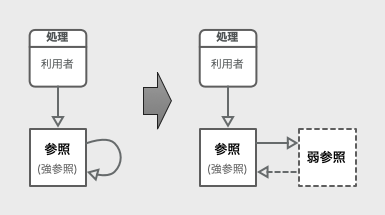
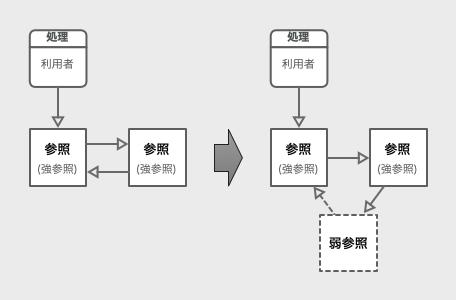
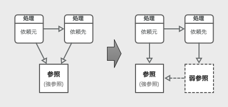

go言語に限定しない一般的な弱参照の説明です。

世の中に「弱参照」のまともな説明がすくないため、仕方なく暫定的に記述したものです。(詳細な理由については、末尾の補足を参照)

# 弱参照(弱い参照/weak reference)
弱参照は、参照先の変数(メモリ)の所有権を持たない参照です。  
対語として、所有権のある本来の参照を「強参照(強い参照/strong reference)」と表現することがあります。  
弱参照は、所有権を持たないので、参照先の変数の解放で自動的に無効化されます。
また、処理中の無効化を回避するため、参照(強参照)への(一時的な)変換も可能です。

## 弱参照で回避できる問題
利用方法を知らないと弱参照の理解が難しいので、弱参照の利用方法についての記述します。

参照を共有すると、条件によっては、メモリが適切に解放できくなる問題が発生します。  
この問題を軽減するための手法の一つが弱参照になります。

参照が共有されたことで、適切にメモリ解放ができなくなる問題を起こす状態には、主に以下の2種類です。

1. 参照が相互に参照している。(循環参照)
	* 参照から共有されている
2. 終了が未定な処理が参照を保持している。
	* 処理から共有されている

構造的には、この2つは、参照を共有(保有)する対象が違うだけです。 
弱参照を使うと、これらの共有状態を、メモリ管理からは共有されていないように見せかけることができ、問題を回避できるわけです。

以降の説明では、それぞれの状態について、もう少し詳しく説明しておきます。

### 1. 参照が相互に参照している状態(循環参照の状態)
単一または複数の参照が、直接または間接的に、循環するように参照した状態です。

この状態にしてしまうと、「参照カウンタ」方式のみメモリ管理では、参照の利用終了を認識できません。  
処理が終了しても、循環分のカウンタ増で参照カウンタが0にならず、メモリ管理には利用中だと認識され、結果的にメモリリークが起こります。

この問題は以下の3種類の方法で、回避可能です。

* 後処理で(一部の)参照を無効にして、参照の循環を壊す。
* 一部の参照を弱参照に代えて、メモリ管理的に循環がない状態にする。
* 一部の参照をコピーした値に代えて、参照の循環がない状態にする。
*  GCで循環参照を解放する(適切に動作するGCを利用する)。

弱参照で解決する場合の以下の図のような参照関係の変更を行います。

弱参照による問題回避の図1(1要素での循環参照の例)  

弱参照による問題回避の図2(複数要素での循環参照の例)  

弱参照を使うと、GCやデータコピー等の実行時のコストを軽減することができます。

### 2. 終了が未定な処理が参照を保持している状態
終了が未定な(処理時間が長い)処理に、参照としてデータを渡すと発生する状態です。  
例えば、処理時間が長いコールバック関数や、動作し続けるサブシステムへ、参照を渡す(共有する)場合が該当します。  

この状態になると、参照を渡した側(依頼元)の処理が終了しても、参照を渡された側(依頼先)の処理は中断されないと続行するので、参照も解放されません。
処理も参照も、どちらも終われない状態になり、実質のメモリリーク状態と、実質の無限ループが起きてしまいます。

この問題は以下のような2種類の方法で回避可能です。

* 中断機能を実装し、依頼元の終了時に確実に実施する。
* 弱参照でデータを渡し、依頼先の処理に参照を保持させない。
* (コピーした値を渡しても、解決しない)
* (実際に参照が利用されてるので、GCでは解決しない)
* (解決せずに放置するプログラムもたまに見かける...)

弱参照を使う場合、自動的に無効化する特徴によって、中断処理も実現が容易になります。

弱参照による問題回避の図3(依頼先の処理も参照を保有する例)  

この問題はGCでは回避できないので、弱参照を使うしかないことがあります。

# 補足(こんな説明が存在する理由)

## GC(ガベージコレクション/garbage collection)の定義
前提として、以下のGCの定義を信じると、きちんと「不要になった領域を自動的に解放しない」機能をGCとして書くのは、誤解を生むので、解説としては不適切と判断しています。

Wikipediaより(2021/12/15現在)
> ガベージコレクション（英: garbage collection; GC）とは、コンピュータプログラムが動的に確保したメモリ領域のうち、不要になった領域を自動的に解放する機能である。

この定義は、LISPから始まるGCの歴史もきちんと踏まえて書かれて、十分信用できそうです。  
そして、この定義に従うなら、「循環参照を自動的に解放できない」メモリ管理は、GCとは言い難いのです。
そうなると、「参照カウンタ」のみに頼ったメモリ管理も、やはりGCとは言い難いのです。

## 世の「弱参照」

そして、上記のGCの定義を理解した上で、世の中の「弱参照」の定義らしき説明を読むと、何かおかしいのです。  
例えば、Wikipediaの説明すら、以下の通りです。

Wikipediaより(2021/12/15現在)
> 弱い参照（英: weak reference、ウィークリファレンス）あるいは弱参照とは、参照先のオブジェクトをガベージコレクタから守ることのできない参照のことである。

実際に、GCがない処理系でも弱参照は使われていて、弱参照はGC専用の仕組みではありません。
そうすると、上記の、GCを前提とした弱参照の説明は、明らかに間違っています。  
このような状況なので、仕方なく書いたのがこの説明です。

おそらく、GCのある処理系での弱参照の「動き」を理解した方が、「弱参照」自体を十分に理解しないまま、使ってる言語の「動き」を文章にした結果、このような状況になっていると予想されます。残念な話です。
